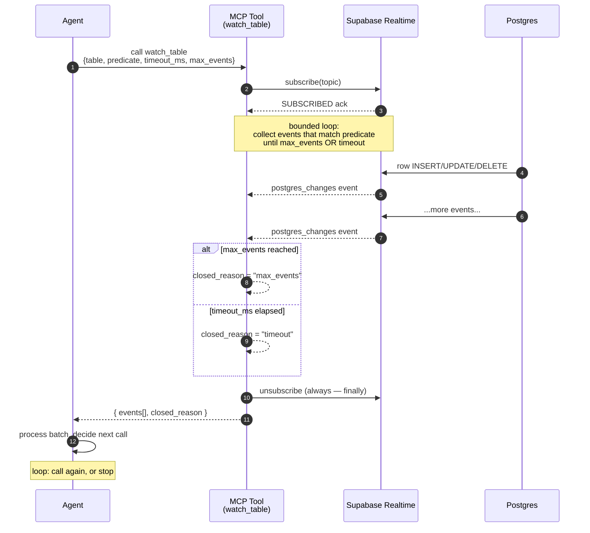

# supabase-realtime-skill

[](https://www.npmjs.com/package/supabase-realtime-skill)
[](https://github.com/0xquinto/supabase-realtime-skill/actions/workflows/ci-fast.yml)
[](LICENSE)

Agent Skill + MCP server that gives an LLM agent a **bounded primitive for reacting to Postgres row-changes** (and coordinating over Realtime broadcast channels) on Supabase. Deploys as an Edge Function. Ships pre-registered eval thresholds and four ADRs documenting the load-bearing tradeoffs.

The headline pattern is **agent-watches-database**: the agent calls a tool that blocks until either `max_events` arrive *or* `timeout_ms` elapses, then returns the batch. No streaming protocol, no persistent connection across tool-calls — fits MCP's request/response shape and Edge Function isolate budgets (Pro caps wall-clock at 150s; this caps tool timeout at 120s).



The "boundary" is the tool-call return — that's the natural checkpoint for an agent loop. Persistent WebSocket fights this model; bounded subscription embraces it.

The full narrative — what was tried, what failed, what landed, with the eval numbers — is in [`docs/writeup.md`](docs/writeup.md).

## Why this exists

Supabase's product direction in 2026 is *"agents running on Supabase, not just against."* Edge Functions, Automatic Embeddings, Agent Skills, MCP-on-Edge — all 2026 moves. The substrate to make agents react to Postgres CDC, with a shape that fits the Edge Function isolate model and respects RLS, didn't exist. This is that substrate.

This isn't a kitchen-sink wrapper. It's five tools, two primitives, one worked example, four eval metrics — opinionated and tight, with the surface area documented in eight references.

## Quick start

Install:

```bash
npm install supabase-realtime-skill        # or: bun add supabase-realtime-skill
```

Use the bounded primitive directly (Node):

```ts
import { boundedWatch, makeSupabaseAdapter } from "supabase-realtime-skill/server";

const adapter = makeSupabaseAdapter("support_tickets", {
  supabaseUrl: process.env.SUPABASE_URL!,
  supabaseKey: process.env.SUPABASE_ANON_KEY!,
});

const { events, closed_reason } = await boundedWatch({
  adapter,
  table: "support_tickets",
  predicate: { event: "INSERT" },
  timeout_ms: 60_000,
  max_events: 10,
});
// events: Array<{ event, table, schema, new, old, commit_timestamp }>
// closed_reason: "max_events" | "timeout" | "error"
```

Deploy the MCP server as an Edge Function (live-verified):

```bash
supabase functions deploy mcp --project-ref <your-project>

# Verify with a JSON-RPC tools/list:
curl -X POST "https://<project-ref>.supabase.co/functions/v1/mcp" \
  -H "Authorization: Bearer <anon_or_service_role_key>" \
  -H "Content-Type: application/json" \
  -H "Accept: application/json, text/event-stream" \
  -d '{"jsonrpc":"2.0","id":1,"method":"tools/list","params":{}}'
# → returns all 5 tools with input schemas
```

See [`references/edge-deployment.md`](references/edge-deployment.md) for full operator setup.

## What's in the box

| Tool | Shape |
|---|---|
| `watch_table` | bounded subscription to Postgres row-changes (INSERT / UPDATE / DELETE / *) |
| `broadcast_to_channel` | fire-and-forget broadcast on a Realtime channel; idempotent retry on 5xx |
| `subscribe_to_channel` | bounded subscription to a Broadcast channel (mirrors `watch_table`'s shape) |
| `list_channels` | best-effort registry listing |
| `describe_table_changes` | introspect columns, PK, RLS state, REPLICA IDENTITY |

All five over `WebStandardStreamableHTTPServerTransport` (MCP SDK 1.29+), per-request stateless. Five tools, intentionally tight — see [`SKILL.md`](SKILL.md) for what *not* to use them for.

## Eval results (latest ci-nightly, n=100, post-ADR-0006)

| Metric | Result | Threshold (manifest v1.0.0) | Status |
|---|---|---|---|
| `latency_to_first_event_ms` p95 | **1300 ms** | ≤ 2000 ms | ✅ PASS |
| `missed_events_rate` | **0/100** (Wilson upper 0.0370) | rate ≤ 0.005, CI upper ≤ 0.01 | rate PASS, CI mechanically unreachable at n=100 — see ADR-0001 |
| `spurious_trigger_rate` | **0/100** (Wilson upper 0.0370) | rate ≤ 0.01, CI upper ≤ 0.03 | rate PASS, CI same as above |
| `agent_action_correctness` | **96/100, CI low 0.902** | rate ≥ 0.90, CI low ≥ 0.85 | ✅ PASS rate AND CI low |

Pre-registered in [`manifest.json`](manifest.json) at v1.0.0; gated via [`eval/runner.ts`](eval/runner.ts); v2.0.0 amendment to bump n→300 deferred per [ADR-0001](docs/decisions/0001-manifest-v1-stays-uncalibrated.md).

Methodology: 4 metrics, binary scoring, Wilson 95% CIs, McNemar paired-test comparisons. No LLM-as-judge as a gate. See [`references/eval-methodology.md`](references/eval-methodology.md).

## Decisions + findings

The judgment trail. Each ADR carries a falsifiable predicted effect.

- [ADR-0001 — manifest v1 stays uncalibrated](docs/decisions/0001-manifest-v1-stays-uncalibrated.md). Wilson CI bounds at n=100 are mechanically unreachable; resist the urge to retroactively soften the gate. v2.0.0 manifest amendment deferred to a versioned bump.
- [ADR-0002 — f019 seed relabel](docs/decisions/0002-f019-seed-relabel.md). The eval caught a mislabeled fixture (a service-bug ticket bucketed as `general`); relabeled with audit trail before re-running ci-nightly.
- [ADR-0003 — dual-path embedding provider](docs/decisions/0003-dual-path-embedding-provider.md). Canonical schema stays spec-compliant `halfvec(1536)` with OpenAI; eval falls through to `halfvec(384)` Transformers.js when `OPENAI_API_KEY` unset. Closes the spec deviation.
- [ADR-0004 — reshape T31 as user-feedback (proposed)](docs/decisions/0004-reshape-t31-as-user-feedback.md). The pre-T31 recon found the upstream maintainer's policy is monolith + references, not federation. Reshape pending operator decision.

Operational findings from the spike — 5s warm-up window, Deno bundler `.ts` extension policy, vitest workspace gotcha — live in [`docs/spike-findings.md`](docs/spike-findings.md).

## Layout

- [`SKILL.md`](SKILL.md) — Open Skills Standard entry; three triggers + tools at a glance
- [`references/`](references/) — 9 opinionated patterns (predicates, RLS, replication identity, pgvector composition, eval methodology, edge deployment, presence-deferred, worked example, outbox forwarder)
- [`src/server/`](src/server/) — MCP server (5 tools) + bounded primitives + production adapters
- [`src/client/`](src/client/) — npm consumer barrel (boundedWatch + schemas + types)
- [`supabase/functions/mcp/`](supabase/functions/mcp/) — Edge Function entry (`WebStandardStreamableHTTPServerTransport`)
- [`eval/`](eval/) — regression harness with pre-registered thresholds + synthesizer + triage agent
- [`fixtures/`](fixtures/) — 20 hand-curated ci-fast seeds + 100 ci-nightly (20 seeds × 5 LLM-augmented variations)
- [`docs/writeup.md`](docs/writeup.md) — the headline narrative
- [`docs/decisions/`](docs/decisions/) — ADRs (0001-0004)
- [`docs/upstream/`](docs/upstream/README.md) — recon + spec + plan that produced this repo
- [`playbook/`](playbook/) — eval methodology backbone

## Engineering polish

- Dual ESM + CJS publish via `tsup` with `.d.ts` and `.d.cts` declarations
- npm publish via [OIDC Trusted Publisher](https://docs.npmjs.com/trusted-publishers/) (no `NPM_TOKEN` secret in CI; sigstore-signed provenance attestation on every release)
- ci-fast (PR-blocking) + ci-nightly (cron) split — full CI in [`.github/workflows/`](.github/workflows/)
- Strict TypeScript (`exactOptionalPropertyTypes`, `noUncheckedIndexedAccess`, `noExplicitAny`)

## License

Apache-2.0. See [LICENSE](LICENSE).

---

**Related work in this portfolio:** [`supabase-mcp-evals`](https://github.com/0xquinto/supabase-mcp-evals) — the methodology research repo whose `playbook/` is the methodology backbone for this artifact's eval discipline. The two repos share the playbook + foundation slices but ship independent artifacts.
