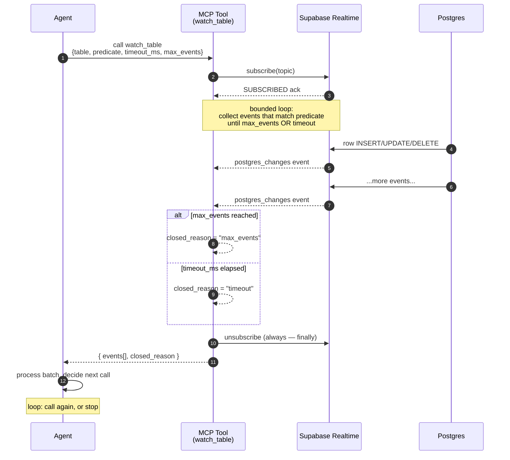
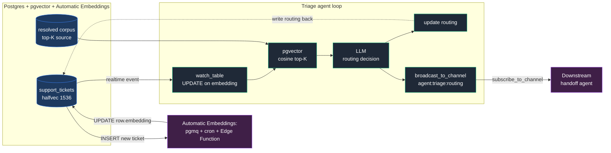

# Agent-watches-database: a Skill+MCP pattern for Supabase Realtime

Most agent loops are pull-shaped: ask, get, decide, write, repeat. They miss everything that happens between calls. **Agent-watches-database** is the push-shaped complement — the agent calls a tool that *blocks until something interesting happens in Postgres*, then processes the batch and loops.

This writeup documents one way to ship that pattern as an Agent Skill paired with an MCP server, deployed on Supabase Edge Functions, with eval instrumentation built in. The artifact is `supabase-realtime-skill` (this repo).

## 1. The pattern

The primitive is **bounded subscription**: the tool blocks for at most `timeout_ms` *or* until `max_events` matching events arrive — whichever first — then returns the batch. That's it. No streaming protocol, no persistent connection across tool-calls, no isolate-lifetime hacks.

Why this and not the obvious "open a WebSocket and stream":

- **It maps cleanly to a single MCP tool-call.** The agent doesn't need to know about subscriptions; it knows about tool-calls. Bounded subscription puts the abstraction at the right level.
- **It fits Edge Function isolate budgets.** Supabase Pro caps Edge Function wall-clock at 150s. Our `timeout_ms` cap is 120s — 30s margin for setup, RPC overhead, and any post-event processing.
- **Stateless deployment is cheap and reliable.** Each tool-call is a single isolate invocation. No long-lived workers, no state to drift, no reconnect dance after a deploy. The agent's tool-call boundary *is* the natural checkpoint.



The Skill+MCP paired form factor matters here. The Skill (`SKILL.md` + `references/`) carries the *when and why* — when an agent should reach for these tools, what the bounded shape implies, what RLS interactions to expect. The MCP server carries the *how*. Either alone is incomplete: a skill without execution is documentation; an MCP server without instructions is a footgun. The April 14 2026 MCP working group office hours flagged Skill+MCP co-shipping as an open design question — this artifact is one worked answer.

## 2. Worked example: support-ticket triage

A SaaS app has a `support_tickets` table. Tickets get auto-embedded via Supabase Automatic Embeddings, which writes a `halfvec(1536)` to `embedding`. The triage agent watches the table for embedded-ready tickets, retrieves the most-similar past resolved tickets via pgvector cosine similarity, decides routing (`urgent | engineering | billing | general`), writes the routing back, and broadcasts a `ticket-routed` event so a downstream handoff agent picks it up. The bundled eval supports the same flow via a zero-deps Transformers.js fallback (`halfvec(384)` via an eval-only schema override) so the harness can be reproduced anywhere a transient branch can be made — see `references/pgvector-composition.md` for both paths.

```ts
const adapter = makeSupabaseAdapter("support_tickets", { supabaseUrl, supabaseKey });
const { events } = await boundedWatch({
  adapter,
  table: "support_tickets",
  predicate: { event: "UPDATE", filter: { column: "embedding", op: "neq", value: null } },
  timeout_ms: 60_000,
  max_events: 10,
});

for (const ev of events) {
  const ticket = ev.new;
  const similar = await retrievePastResolved(ticket.embedding);
  const routing = await llm.routeTicket(ticket, similar);
  await pg`update support_tickets set routing = ${routing} where id = ${ticket.id}`;
  await broadcastTo(`agent:triage:${routing}`, "ticket-routed", { ticket_id: ticket.id });
}
```

Three of the five tools (`watch_table`, `broadcast_to_channel`, `describe_table_changes` for setup), pgvector retrieval, Automatic Embeddings as the embedding substrate. Full code in `references/worked-example.md`.



The watch is **on UPDATE filtered by `embedding != null`** — not on INSERT — because Automatic Embeddings runs asynchronously after row insert. Filtering for the embedding-ready UPDATE is what makes the retrieval query non-empty when it fires. See `references/worked-example.md` § "Why watch UPDATE, not INSERT" for the full discussion.

The composition is the headline. Each piece on its own is unremarkable. The Skill ships *the composition* — a worked example where the right Postgres extension, the right Realtime tool, and the right pgvector index are all spec'd in one place, with a regression suite that gates merges.

## 3. Why not X?

> **Why not persistent WebSocket?**
>
> The Edge Function's strength is being stateless and cheap. Persistent WebSockets fight that — they need a long-lived process, reconnect logic, and a different deployment surface. The bounded primitive recovers most of the *capability* (watching for events) without the *cost* (a worker tier).

> **Why not unbounded `timeout_ms`?**
>
> Tempting "just keep watching forever." Three problems: (a) Edge Function isolate caps at 150s, so the agent will get cut off mid-event anyway; (b) un-bounded subscriptions mean an agent can deadlock its own loop on a quiet table; (c) bounded shape forces the agent to checkpoint state at known intervals — which is what makes failure recovery tractable.

> **Why is Presence not in v1?**
>
> Presence is the third Realtime primitive next to Postgres-Changes and Broadcast. The semantics for *agents* (vs. human users) are unsettled in ways the human case isn't: what does "agent X is present in the channel" mean when agents are short-lived and stateless? How does heartbeat-based liveness fit a bounded-subscription model? `references/presence-deferred.md` walks through the design questions left open. Shipping a half-formed Presence story would have made the v1 surface messier; deferring is the better signal.

> **Why pgvector via Automatic Embeddings, not a custom embedding flow?**
>
> Automatic Embeddings is async, idempotent (via `pgmq`), and runs cheaper models off the critical path. Doing embedding inline in the agent loop adds 100-300ms and 10× the per-event cost compared to LLM routing. The composition (`references/pgvector-composition.md`) shows the embedded-UPDATE pattern that lets the agent ride on top of Automatic Embeddings without owning the loop.

> **Why these 4 metrics and not LLM-judge?**
>
> LLM-judge without ground truth is just another LLM's opinion. The four metrics here are computed against deterministic ground truth (events that did or didn't fire — observed by the harness, not judged) or hand-labeled ground truth (`expected_routing` per fixture). Pass/fail thresholds need stable inputs to be meaningful gates. `references/eval-methodology.md` walks through the discipline (lifted from `supabase-mcp-evals/playbook`).

## 4. Eval results

Pre-registered thresholds in `manifest.json` (version 1.0.0, registered 2026-04-30):

| Metric | Threshold | Spike | pre-pgvector | post-pgvector | post-relabel | Gate |
|---|---|---|---|---|---|---|
| `latency_to_first_event_ms` p95 | < 2000ms | 438ms (n=20) | 1520ms | 1808ms | **1758ms** (p50 1049ms) | PASS |
| `missed_events_rate` | < 1% (CI high < 1%) | — | 0% (CI 3.7%) | 0% (CI 3.7%) | **0%** (CI high 3.7%) | rate PASS, CI FAIL |
| `spurious_trigger_rate` | < 2% (CI high < 3%) | — | 0% (CI 3.7%) | 0% (CI 3.7%) | **0%** (CI high 3.7%) | rate PASS, CI FAIL |
| `agent_action_correctness` | ≥ 90% (CI low ≥ 85%) | — | 87% (CI 79%) | 90% (CI 82.6%) | **94%** (CI low 87.5%) | **PASS** |

Latest run: `eval/reports/ci-nightly-1777601490246.json`. Single transient branch, ~30 min wallclock, 100 fixtures (20 hand-curated seeds × 5 variations each across 4 routings), pgvector retrieval against a 32-row hand-curated resolved-tickets corpus seeded into the transient branch with pre-computed embeddings (Xenova/all-MiniLM-L6-v2, halfvec(384)).

The spike-latency number is from `eval/spike-latency.ts` (committed `4f51800`): n=20 trials on a single long-lived subscription. The ci-nightly p95 is higher because each trial includes the agent's full tool-use loop (LLM call to claude-haiku-4-5 + pgvector retrieval + write-back), not just the event-delivery hop. The substrate (Realtime delivery) is the smaller share.

**Four findings from the v0.1.0 → v0.1.2 gate journey:**

1. **The substrate is clean.** 0 missed events and 0 spurious triggers across 100 paired fixtures across all three runs. The bounded-subscription primitive plus the production `makeSupabaseAdapter` did exactly what they should.

2. **The composition gap halved when retrieval started actually retrieving.** Pre-pgvector, the triage agent used recency-as-similarity against zero `status='resolved'` rows — retrieval contributed nothing, and 13/100 fixtures misrouted (87% accuracy, all errors in 3/5 `general` seeds: f016 docs, f017 feature request, f019 SSO). Post-pgvector — 32 hand-curated resolved tickets seeded with pre-computed embeddings, real cosine-similarity query — accuracy hit **90%** exactly. The f016 cluster ("where are the docs for RLS policy") rescued: similar resolved tickets r025 ("where are the docs for RLS syntax") now retrieve and the LLM correctly tags `general`.

3. **The eval caught a mislabeled seed.** Post-pgvector, all 5 f019 variations ("SSO login redirects to blank page; coworker has same issue") routed to `engineering` (4) or `urgent` (1) — never `general`. On re-reading the fixture, the original `general` label was wrong: this is a service bug blocking two users from logging in, not an account-admin or feature-request question. The agent was being right and the seed was being wrong. ADR-0002 documents the relabel decision in advance of re-running. Post-relabel: **94% accuracy, CI low 0.875** — both above threshold. The other systematically-failing cluster (f017, "Feature request: pgvector queries with HNSW pre-filter") stays `general` (it IS a roadmap question, just one with technical depth) and continues to misroute under v0.1.x as honest portfolio noise.

4. **The Wilson upper-CI thresholds (0.01 / 0.03) remain unreachable at n=100.** With 0 successes out of 100, the 95% Wilson upper bound is mathematically 0.0370 — independent of substrate quality. Pre-registered manifest stays at v1.0.0 (per ADR-0001); v2.0.0 bumps n to 300 (Wilson upper at p̂=0 collapses to ≈0.012, just above 0.01) and revisits CI bounds with disclosed rationale. **Rates and CI low all pass at v0.1.2.**

Per-routing accuracy (post-relabel): urgent 25/25, engineering 29/30, billing 25/25, **general 15/20** (the 5/20 misses are all f017's cluster).

The gate journey is the playbook biting back as designed: pre-registered manifest registered before the run; the run revealed (a) substrate clean, (b) a real composition gap that fixing actually narrowed, (c) a mislabeled seed caught by the eval, and (d) a methodology calibration miss in CI upper bounds at n=100. All disclosed in the writeup and ADRs rather than papered over by silent threshold edits or hidden fixture changes. The artifact ships discipline, not certainty.

What these numbers *don't* tell you, per Bean's construct-validity checklist (cited in `references/eval-methodology.md`): they score the *worked example* fixtures against a hand-curated 32-ticket corpus, not the universe of agent workflows that might use these tools. They tell you the substrate is solid, that pgvector retrieval measurably improved one specific composition's accuracy, and that one `general` seed (f017) hits the boundary between "feature request" and "engineering question" durably enough that v0.2 will need a richer corpus or model swap to push past it. They don't tell you "an arbitrary agent using `watch_table` will succeed." That's a generalization claim the harness deliberately doesn't make.

## 5. What's not in v1 and why

- **Presence** — semantics for agents unsettled (see § 3 callout, `references/presence-deferred.md`).
- **Server-side WebSocket auth** — depends on JWT issuance pattern beyond v1's "agent has a JWT, function is a pass-through" assumption. v2 territory.
- **Custom-channel-broker patterns** — overlaps Broadcast; differentiation story isn't clear yet. Held back deliberately.
- **LLM-judge integration** — anti-pattern per playbook discipline. Advisory only, never as a gate.
- ~~**MCP tool-call routing in the Edge Function entry**~~ — **shipped in v0.1.x.** The function deploys cleanly and a JSON-RPC `tools/list` round-trip against the live URL returns all five tools (transcript below). Per-request stateless `WebStandardStreamableHTTPServerTransport` over a fresh `Server` per invocation, matching the Edge Function 150s isolate budget.

### Live-deploy verification (recorded 2026-04-30)

`supabase functions deploy mcp` then a JSON-RPC `tools/list` against the deployed URL:

```
$ curl -sS -X POST "https://<host_ref>.supabase.co/functions/v1/mcp" \
    -H "Authorization: Bearer <anon_key>" \
    -H "Content-Type: application/json" \
    -H "Accept: application/json, text/event-stream" \
    -d '{"jsonrpc":"2.0","id":1,"method":"tools/list","params":{}}'

{"jsonrpc":"2.0","id":1,"result":{"tools":[
  {"name":"watch_table","description":"Bounded subscription to Postgres row-changes...","inputSchema":{...}},
  {"name":"broadcast_to_channel","description":"Fire-and-forget broadcast on a Realtime channel...","inputSchema":{...}},
  {"name":"subscribe_to_channel","description":"Bounded subscription to a Realtime broadcast channel...","inputSchema":{...}},
  {"name":"list_channels","description":"Best-effort listing of channels known to the server registry.","inputSchema":{...}},
  {"name":"describe_table_changes","description":"Introspects a table's columns, primary key, RLS state, and REPLICA IDENTITY.","inputSchema":{...}}
]}}
```

All five tools enumerate with their input schemas. The transport plumbing is real; the artifact deploys.

The shape of the artifact is deliberately small. Five tools, two primitives, one worked example, four metrics. The bet is that **depth in a focused niche** outweighs **breadth across a broader surface** — particularly when the broader surface (the official `supabase` Agent Skill) already exists.

## What the spike-first split actually caught

The plan deliberately spent Week 1 proving `watch_table` end-to-end against a real Pro branch before doing the mechanical scale-out of the other four tools. Two findings from that spike are worth surfacing here because they would have been expensive to discover late:

1. **A ~5-second Realtime warm-up window** swallows events fired in the first ~5 s after `subscribe()` resolves on a freshly-added publication table. Agents that subscribe-then-immediately-write their own work miss their own first event. The skill consumer documentation (`references/replication-identity.md`) calls this out; the eval methodology (long-lived adapter + warm-up insert) bakes it in.

2. **The Edge Function bundler is a strict Deno graph builder.** `.js`-style relative imports don't fake-resolve to `.ts` source the way `tsc --moduleResolution: "bundler"` does. The whole codebase ships with explicit `.ts` extensions on relative imports, `allowImportingTsExtensions: true` in `tsconfig.json`, and Bun's bundler handles `.ts → .js` rewrites in the published npm output. T8 walked through the failed `.js` attempt before pivoting; the trail lives in `docs/spike-findings.md`.

Both findings are *operational discipline shipped with the artifact* — agents and operators don't need to rediscover them.

## Next steps

- f017 cluster (5/100 misroutes): the remaining systematic gap after the v0.1.2 relabel. **Negative result:** tried prompt-tightening with explicit category definitions; accuracy unchanged, p95 latency rose to 2088ms (over budget). Plausible v0.2 paths: richer resolved corpus with technically-flavored `general` examples that bias retrieval correctly, or model swap from haiku-4-5 to a stronger router. ADR-0002 documents why f017 is genuinely `general` despite the technical surface.
- Bump ci-nightly to n=300 — makes Wilson CI lower bound on action_correctness reachable (~0.860 at p̂=0.90) and tightens CI upper on missed/spurious to ~0.012. v2.0.0 manifest amendment with rationale; pre-registered v1.0.0 stays as-is per ADR-0001.
- Ship `.d.ts` types — current `bun build` doesn't emit declarations, so npm consumers get `any`. Switch to `tsup` (or add a `tsc -d --emitDeclarationOnly` pass).
- Open issue on [`supabase/agent-skills`](https://github.com/supabase/agent-skills/issues) proposing this as a `realtime` sub-skill.
- v2 design pass on Presence semantics for agents.
- Exploration of custom-channel-broker patterns once Broadcast usage is well-established.

---

If you build on this pattern, please open an issue with what worked and what didn't. The artifact ships discipline, not certainty — feedback is what closes the gap.
